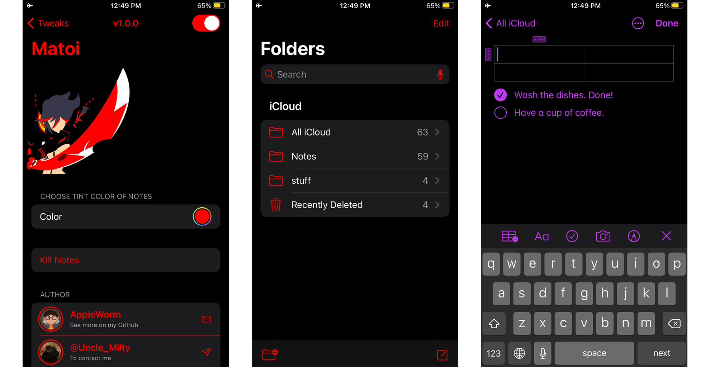
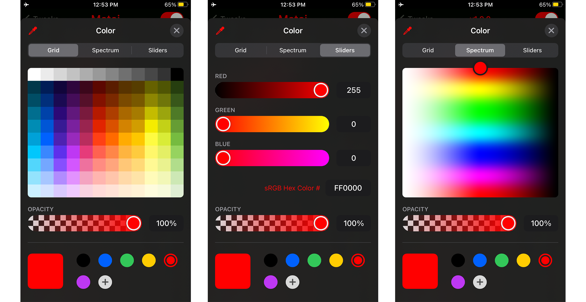

# Matoi
Notes tintColor customizer

### Preview

### Choose any color you want

### Dependencies 
  - [Cephei](https://github.com/hbang/libcephei)
  - [LibGcUniversal](https://github.com/MrGcGamer/LibGcUniversalDocumentation)

### Compiling
  - [Theos](https://theos.dev/) is required to compile the project.

### Compatibility
iPhone running 14.x & [15.x?]

### License
[Standart MIT license](https://github.com/AppIeWorm/Matoi/blob/main/LICENSE)
